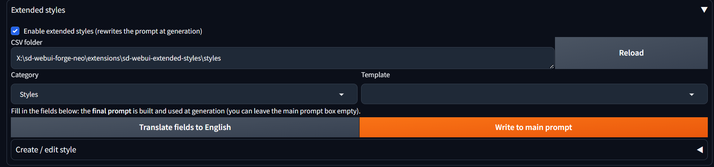
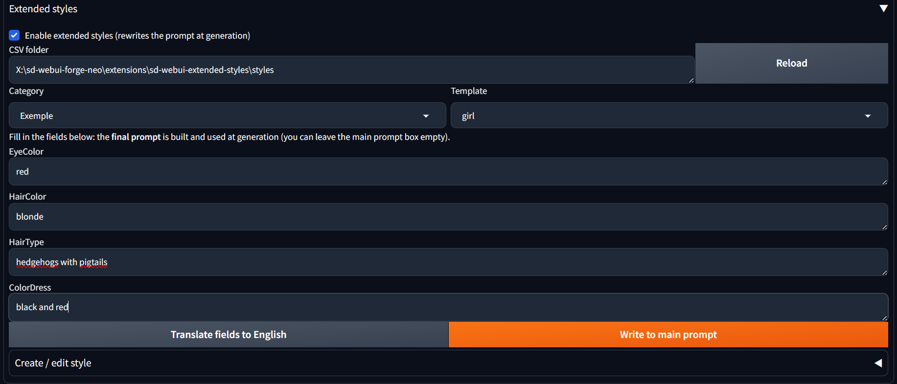
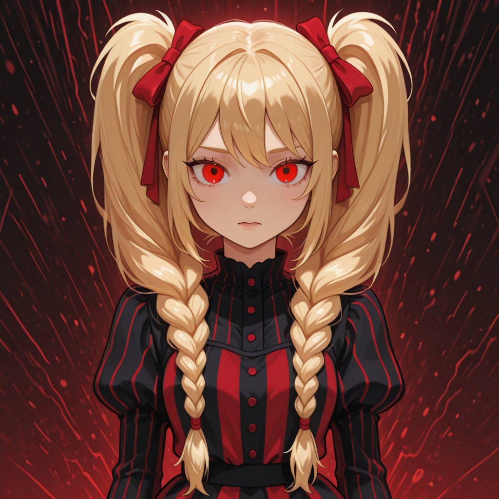
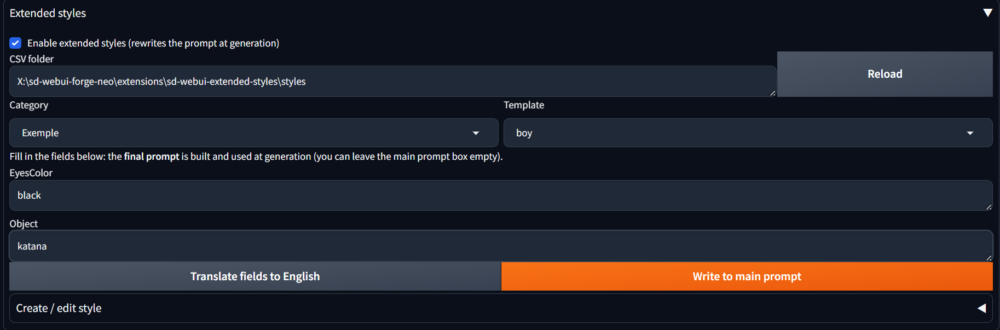
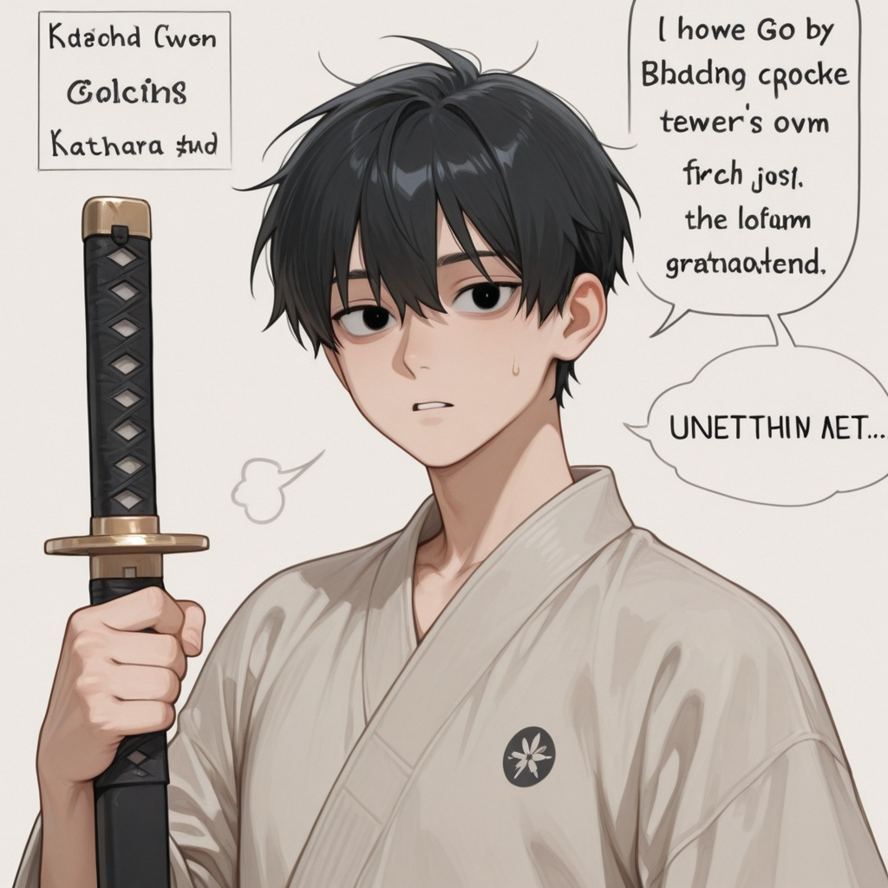

# Extended Styles

An extension for **Stable Diffusion WebUI Forge / Forge Neo / AUTOMATIC1111** that upgrades the
built‑in *Styles* system with **multiple, named placeholders**.

The native styles system only understands a single `{prompt}`. Extended Styles lets a single style
template contain as many slots as you want — `{prompt_face}`, `{prompt_haircolor}`,
`{prompt_flowercolor}`, … — and gives you a labeled field for each, so you can reuse one template for
many different results without rewriting it every time.



## Features

- **Multiple placeholders per style** — `{prompt}`, numbered `{prompt1}`, and named `{prompt_xxx}`.
- **Auto‑generated fields** — pick a style and one labeled input appears per placeholder.
- **Choice variables** — `{prompt_Gender=Male|Female}` becomes a dropdown; later placeholders with the
  same name follow the chosen option by index, so one menu drives several coordinated substitutions.
  Multiple independent variables per style are supported. Controls appear in the same order as the
  placeholders in the prompt (text fields and menus interleaved).
- **NSFW preview filter** — a toggle that blurs the carousel thumbnails of styles whose name contains
  "NSFW" (case-insensitive); hover a thumbnail to peek. Remembered per browser.
- **Preview carousel** — each style shows a thumbnail; click one to select it. Set a thumbnail from the
  last generated image with one click, or by dropping an image. A slider resizes the thumbnails and the
  size is remembered (per browser).
- **Category separators** — rows named `----SECTION----` in a CSV act as visual dividers and are hidden
  from the style list, so you can organize big files.
- **Optional placeholders** — leave a field empty and its placeholder is simply dropped from the prompt
  (leftover spaces and commas are cleaned up), so one template covers cases with or without a detail.
- **Readable field labels** — a hyphen in a named placeholder is shown as a space, e.g.
  `{prompt_hair-color}` → label "hair color".
- **Built‑in translation** — write your values in any language and translate them to English with one
  click (auto‑detects the language; text already in English is left unchanged).
- **Write to main prompt** — one button drops the assembled prompt **and negative prompt** into the real
  boxes, so *Send to img2img*, PNG info and everything downstream just work. (The negative is only
  written when the style has one, so your own negative isn't wiped.)
- **Create / edit styles** — pick a style to edit and its fields fill in automatically; saving updates
  the CSV in place (or adds a new one), with a `.bak` backup before writing.
- **Works alongside prompt editors** like *prompt‑all‑in‑one* — values are filled in this panel and the
  substitution happens server‑side.

## Installation

1. Copy this folder into your WebUI `extensions` directory
   (e.g. `webui/extensions/sd-webui-extended-styles`), or use
   *Extensions → Install from URL* with this repository's URL.
2. Fully restart the WebUI.
3. A new **Extended styles** panel appears in txt2img and img2img.

## Usage

1. Open the **Extended styles** panel.
2. In **CSV folder**, enter the folder that holds your style `.csv` files (you can point it at your
   existing styles folder) and press **Reload**. Each `.csv` file becomes a **Category**.
3. Choose a **Category** and a **Template**. One labeled field appears per placeholder.
4. Fill in the fields.
5. *(optional)* Press **Translate fields to English** if you wrote in another language.
6. Press **Write to main prompt** — the assembled prompt is written into the real prompt box.
7. Generate as usual.

> You can also tick **Enable extended styles** instead of using *Write to main prompt*: with it on, the
> extension rewrites the prompt automatically at generation time and you can leave the main prompt box
> empty. (See the note about Dynamic Prompts below.)

### Creating or editing a style

Open **Create / edit style**, then pick the **Category** and **Style to edit** — the name, prompt and
negative fields fill in automatically. Change what you want and press **Save style** (same name → updates
it in place; a new name → adds it). Press **New** to clear the fields and start from scratch, or
**Delete style** to remove the one selected in *Style to edit* (with a confirmation). A `.bak`
backup of the CSV is made before every save or delete.

### Style previews

Every style shows a thumbnail in the **Style previews** carousel (a gray name tile until you set one);
click a thumbnail to select that style. Use the **Thumbnail size** slider to resize the carousel — the
value is remembered in your browser. To set a preview, open **Set style preview**: select the style,
**generate** an image and press **Apply last generation**, or drag an image and press **Apply uploaded
image**. Previews are stored as PNGs in the extension's `previews/` folder.

## Placeholder syntax

| In the CSV | Meaning | Field label |
|---|---|---|
| `{prompt}` | classic single slot | `prompt` |
| `{prompt1}`, `{prompt2}` | numbered slots | `1`, `2` |
| `{prompt_face}`, `{prompt_haircolor}` | **named** slots (recommended) | `face`, `haircolor` |
| `{prompt_hair-color}` | named slot, hyphen shown as a space | `hair color` |

Named placeholders are recommended because the field label tells you exactly what each slot is for.
Use a hyphen when you want a multi‑word label (`{prompt_eye-color}` → "eye color").

Any field you leave empty is **optional**: its placeholder is removed from the final prompt (instead of
appearing literally), and the surrounding spaces and commas are tidied up. Tip: for optional details,
place the placeholder as its own comma‑separated clause (e.g. `a girl, {prompt_extra}, red hair`) so it
disappears cleanly when empty.

### Choice variables

Add options after `=`, separated by `|`, to turn a placeholder into a **dropdown**:

```
{prompt_Gender=Male|Female}
```

The **first** occurrence of a name defines the menu (its options are the labels). Every later
placeholder with the **same name** is linked to it: it inserts its own option at the **same index** as
the selected choice. Commas inside an option go straight into the prompt.

```
a human {prompt_Gender=Male|Female} in a loose shirt revealing his {prompt_Gender=hairy chest|chest with a pink bra}
```

- Choosing **Male** → "a human Male in a loose shirt revealing his hairy chest"
- Choosing **Female** → "a human Female in a loose shirt revealing his chest with a pink bra"

You can define **several independent variables** in one style (up to 6), each with its own dropdown.
If a linked option list is shorter than the selected index, that spot is left empty. Tip: put fixed
words that must change with the choice *inside* the options (e.g. `{prompt_Gender=A man|A woman}`).

## CSV format

Standard Forge/A1111 styles format:

```csv
name,prompt,negative_prompt
Girl with flower,a girl {prompt_face} holding the {prompt_flowercolor} flower,
Detailed portrait,portrait of a woman {prompt_face} with {prompt_haircolor},lowres bad anatomy
```

To extend an existing single‑`{prompt}` style, just open the CSV and add more `{prompt_xxx}`
placeholders wherever you need them. Up to **8** placeholders per style (see `MAXF` in the script).

To group styles inside one file, add rows whose name is wrapped in dashes, e.g. `----WOMEN----`. These
are treated as separators and hidden from the style list (they still remain in the file).

## Notes

- **Translation** uses the free Google Translate endpoint and therefore needs an internet connection.
- **Styles saved into files loaded by the native `--styles-file`** will also show up in the native
  styles dropdown, where only the classic `{prompt}` works — apply named/numbered styles **through this
  extension**.
- **Dynamic Prompts:** generating with a completely empty prompt while the Dynamic Prompts extension is
  enabled raises `StopIteration` (a Dynamic Prompts limitation). If you use both together, don't leave
  the prompt box empty — press **Write to main prompt** first, or type at least a space.

## Screenshots

<!-- Rename your images to images/preview-1.png ... preview-5.png and edit the captions below. -->

| | |
|---|---|
|  |  |
|  |  |

## Changelog

### v2.1.1
- Fix: **Write to main prompt** now also fills the **negative prompt** box (previously the style's
  negative was only applied with *Enable extended styles* ticked). Left untouched when the style has
  no negative.

### v2.1.0
- **Placeholder order** — controls now render in the order the placeholders appear in the prompt
  (text fields and choice menus interleaved), instead of variables always last.
- **Delete style** — a button to remove the selected style from its CSV, with confirmation and backup.
- **NSFW preview filter** — toggle to blur thumbnails of styles with "NSFW" in the name; hover to peek.

### v2.0.0
- **Choice variables** — `{prompt_Name=opt1|opt2}` placeholders become dropdowns; later placeholders
  with the same name follow the selected option by index. Multiple independent variables per style.

### v1.1.0
- Hide the numeric value box next to the thumbnail-size slider (cosmetic).

### v1.0.0
- **Preview carousel** — per-style thumbnails (click to select), set from the last generation or an
  uploaded image, with a size slider remembered per browser.
- **Category separators** — `----SECTION----` rows are hidden from the style list.
- **Optional placeholders** — empty fields are dropped from the prompt, with cleanup of leftover
  spaces and commas.
- **Hyphen labels** — a hyphen in a named placeholder is shown as a space in the field label.
- **Direct style editing** — dropdowns to pick the style to edit (fields auto‑fill) plus a **New** button.
- **Faster translation** — all fields are translated in a single request.

## License

MIT — see [LICENSE](LICENSE).
